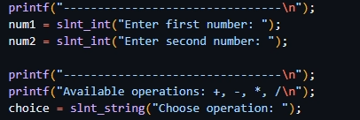
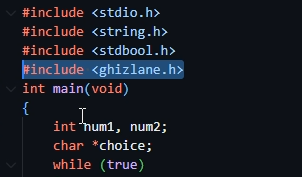

#  SILENT LIBRARY
A small library and it my first library for C/C++
---

## ▶️ How to install it !

1. copy " libsilent.a " paste in folder " C:\msys64\ucrt64\lib " 
2. copy " ghizlane " paste in folder " C:\msys64\ucrt64\include "

- **C/C++**
---

##  Author

Developed by **S1LENT**
